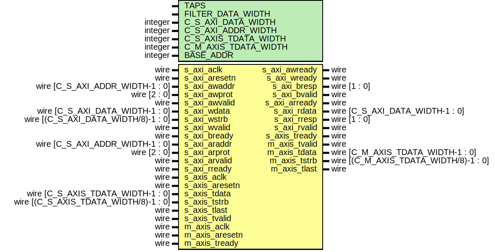

# A Generic Custom Transposed Form FIR Filter AXI IP with parametrizable order & Signal Width
# HARDWARE 
## A. DESIGN 
 

* Parametrized FIR Filter with parametrizable order & Signal Width. 
* Transposed form for higher performance 
* AXI Wrapper with AXI lite slave , AXI stream slave & AXI stream master for easy IP integration 
    * AXI Lite interface for saving filter coefficients & Controlling the Filter
    * AXI Stream Master & Slave interfaces for moving signal to be filtered

## B. Simulation (MATLAB vs HW)

* Noisy signal was generated using MATLAB the stimulus was used in the testbench to verify the Filter.
### MATLAB 

### Questasim
AXI Lite signals 

AXI Stream and Filterd Signal

## C. FPGA Implementation & Testing

### The filter was packaged as a Custom AXI IP & prototyped on the ZYNQ US+ MPSoC AVNET U96 Board as a part of the PL controlled by the ARM Cortex A53 PS
### **VIVADO IPI**

### **SYSTEM ILA** 
#### Probing the AXI Bus between th Zynq PS and The Filter & the Filter Master & Slave AXI stream Bus 

 

### **Perfomance**
#### The used clock period is 10ns with 4.39ns +ve setup slack without pipelinig the DSP48 slices  

# TEST SOFTWARE
A unit test software was developed to fully test the FPGA implementation of the filter using direct register read/write for the 2 FIFOs and the Filter. The software includes `my_fir_filter.h`, which has `u32 fir_init()` that 
* Writes the FIR coefficients to the filter
* Starts the filter 
* Reads the coefficients back
thus testing the AXI Lite filter interface. 

The `fir_test.c` file 
* Initializes the Tx and Rx FIFOs
* Sends a MATLAB-generated noisy sin signal
* Reads the Rx FIFO output and compares it to the MATLAB-generated output, reporting any mismatches.

# Test Results 

### No Mismacthes between MATLAB and the FIR filter output read by the ARM A53

# HDL Documentation
## Module my_fir_v1_0 
## Diagram

## Parameters

| Paramter name        | Type    | Value        | Description                          |
| -------------------- | ------- | ------------ | ------------------------------------ |
| TAPS                 |         | 53           | FIlter Order+1                       |
| FILTER_DATA_WIDTH    |         | 16           | Fixed point data width of the filter |
| C_S_AXI_DATA_WIDTH   | integer | 32           | AXI lite data width                  |
| C_S_AXI_ADDR_WIDTH   | integer | 32           | AXI lite address width               |
| C_S_AXIS_TDATA_WIDTH | integer | 32           | AXI stream sink data width           |
| C_M_AXIS_TDATA_WIDTH | integer | 32           | AXI stream source data width         |
| BASE_ADDR            | integer | 32'hA0000000 | AXI lite Base Address                |

## AXI Wrapper
### AXI Lite
| Port name      | Direction | Type                                  | Description |
| -------------- | --------- | ------------------------------------- | ----------- |
| s_axi_aclk     | input     | wire                                  |             |
| s_axi_aresetn  | input     | wire                                  |             |
| s_axi_awaddr   | input     | wire [C_S_AXI_ADDR_WIDTH-1 : 0]       |             |
| s_axi_awprot   | input     | wire [2 : 0]                          |             |
| s_axi_awvalid  | input     | wire                                  |             |
| s_axi_awready  | output    | wire                                  |             |
| s_axi_wdata    | input     | wire [C_S_AXI_DATA_WIDTH-1 : 0]       |             |
| s_axi_wstrb    | input     | wire [(C_S_AXI_DATA_WIDTH/8)-1 : 0]   |             |
| s_axi_wvalid   | input     | wire                                  |             |
| s_axi_wready   | output    | wire                                  |             |
| s_axi_bresp    | output    | wire [1 : 0]                          |             |
| s_axi_bvalid   | output    | wire                                  |             |
| s_axi_bready   | input     | wire                                  |             |
| s_axi_araddr   | input     | wire [C_S_AXI_ADDR_WIDTH-1 : 0]       |             |
| s_axi_arprot   | input     | wire [2 : 0]                          |             |
| s_axi_arvalid  | input     | wire                                  |             |
| s_axi_arready  | output    | wire                                  |             |
| s_axi_rdata    | output    | wire [C_S_AXI_DATA_WIDTH-1 : 0]       |             |
| s_axi_rresp    | output    | wire [1 : 0]                          |             |
| s_axi_rvalid   | output    | wire                                  |             |
| s_axi_rready   | input     | wire                                  |             |

### AXI Stream Slave
| Port name      | Direction | Type                                  | Description |
| -------------- | --------- | ------------------------------------- | ----------- |
| s_axis_aclk    | input     | wire                                  |             |
| s_axis_aresetn | input     | wire                                  |             |
| s_axis_tready  | output    | wire                                  |             |
| s_axis_tdata   | input     | wire [C_S_AXIS_TDATA_WIDTH-1 : 0]     |             |
| s_axis_tstrb   | input     | wire [(C_S_AXIS_TDATA_WIDTH/8)-1 : 0] |             |
| s_axis_tlast   | input     | wire                                  |             |
| s_axis_tvalid  | input     | wire                                  |             |

### AXI Stream Master
| Port name      | Direction | Type                                  | Description |
| -------------- | --------- | ------------------------------------- | ----------- |
| m_axis_aclk    | input     | wire                                  |             |
| m_axis_aresetn | input     | wire                                  |             |
| m_axis_tvalid  | output    | wire                                  |             |
| m_axis_tdata   | output    | wire [C_M_AXIS_TDATA_WIDTH-1 : 0]     |             |
| m_axis_tstrb   | output    | wire [(C_M_AXIS_TDATA_WIDTH/8)-1 : 0] |             |
| m_axis_tlast   | output    | wire                                  |             |
| m_axis_tready  | input     | wire                                  |             |
