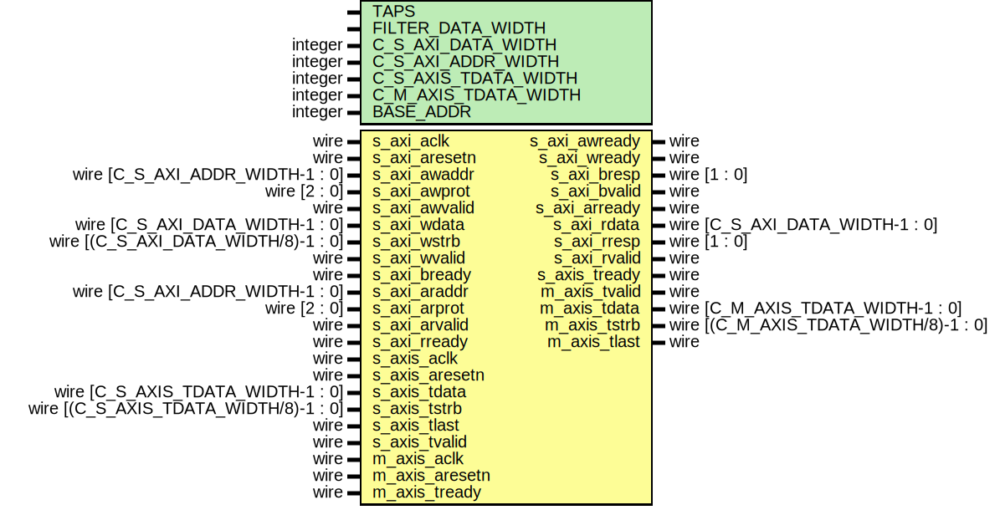

# HDL Documentation

# Module: my_fir_v1_0 
- **File**: my_fir_v1_0.v

## Diagram

## Generics

| Paramter name        | Type    | Value        | Description                          |
| -------------------- | ------- | ------------ | ------------------------------------ |
| TAPS                 |         | 53           | FIlter Order+1                       |
| FILTER_DATA_WIDTH    |         | 16           | Fixed point data width of the filter |
| C_S_AXI_DATA_WIDTH   | integer | 32           | AXI lite data width                  |
| C_S_AXI_ADDR_WIDTH   | integer | 32           | AXI lite address width               |
| C_S_AXIS_TDATA_WIDTH | integer | 32           | AXI stream sink data width           |
| C_M_AXIS_TDATA_WIDTH | integer | 32           | AXI stream source data width         |
| BASE_ADDR            | integer | 32'hA0000000 | AXI lite Base Address                |

## Ports

| Port name      | Direction | Type                                  | Description |
| -------------- | --------- | ------------------------------------- | ----------- |
| s_axi_aclk     | input     | wire                                  |             |
| s_axi_aresetn  | input     | wire                                  |             |
| s_axi_awaddr   | input     | wire [C_S_AXI_ADDR_WIDTH-1 : 0]       |             |
| s_axi_awprot   | input     | wire [2 : 0]                          |             |
| s_axi_awvalid  | input     | wire                                  |             |
| s_axi_awready  | output    | wire                                  |             |
| s_axi_wdata    | input     | wire [C_S_AXI_DATA_WIDTH-1 : 0]       |             |
| s_axi_wstrb    | input     | wire [(C_S_AXI_DATA_WIDTH/8)-1 : 0]   |             |
| s_axi_wvalid   | input     | wire                                  |             |
| s_axi_wready   | output    | wire                                  |             |
| s_axi_bresp    | output    | wire [1 : 0]                          |             |
| s_axi_bvalid   | output    | wire                                  |             |
| s_axi_bready   | input     | wire                                  |             |
| s_axi_araddr   | input     | wire [C_S_AXI_ADDR_WIDTH-1 : 0]       |             |
| s_axi_arprot   | input     | wire [2 : 0]                          |             |
| s_axi_arvalid  | input     | wire                                  |             |
| s_axi_arready  | output    | wire                                  |             |
| s_axi_rdata    | output    | wire [C_S_AXI_DATA_WIDTH-1 : 0]       |             |
| s_axi_rresp    | output    | wire [1 : 0]                          |             |
| s_axi_rvalid   | output    | wire                                  |             |
| s_axi_rready   | input     | wire                                  |             |
| s_axis_aclk    | input     | wire                                  |             |
| s_axis_aresetn | input     | wire                                  |             |
| s_axis_tready  | output    | wire                                  |             |
| s_axis_tdata   | input     | wire [C_S_AXIS_TDATA_WIDTH-1 : 0]     |             |
| s_axis_tstrb   | input     | wire [(C_S_AXIS_TDATA_WIDTH/8)-1 : 0] |             |
| s_axis_tlast   | input     | wire                                  |             |
| s_axis_tvalid  | input     | wire                                  |             |
| m_axis_aclk    | input     | wire                                  |             |
| m_axis_aresetn | input     | wire                                  |             |
| m_axis_tvalid  | output    | wire                                  |             |
| m_axis_tdata   | output    | wire [C_M_AXIS_TDATA_WIDTH-1 : 0]     |             |
| m_axis_tstrb   | output    | wire [(C_M_AXIS_TDATA_WIDTH/8)-1 : 0] |             |
| m_axis_tlast   | output    | wire                                  |             |
| m_axis_tready  | input     | wire                                  |             |

## Signals

| Name       | Type                            | Description |
| ---------- | ------------------------------- | ----------- |
| en         | wire                            |             |
| filter_in  | wire [C_M_AXIS_TDATA_WIDTH-1:0] |             |
| filter_out | wire [C_M_AXIS_TDATA_WIDTH-1:0] |             |

## Instantiations

- my_fir_v1_0_S_AXI_inst: my_fir_v1_0_S_AXI
- my_fir_v1_0_S_AXIS_inst: my_fir_v1_0_S_AXIS
- my_fir_v1_0_M_AXIS_inst: my_fir_v1_0_M_AXIS
